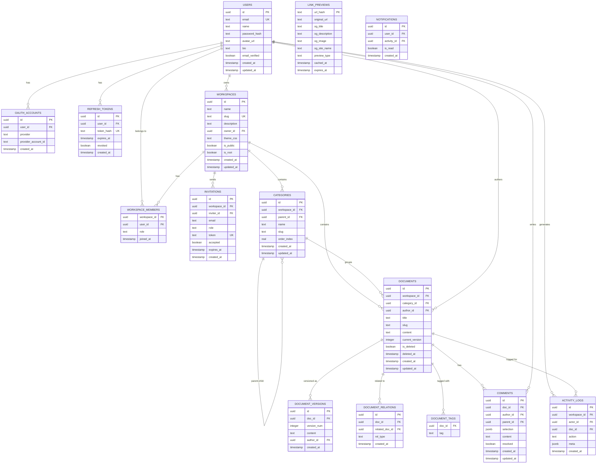

# 004 — 데이터 모델 (Data Model & ERD)

> **최종 수정:** 2026-03-26
> **DB:** PostgreSQL 16 · **ORM:** Drizzle ORM
> **상태:** 📋 계획됨 (KMS SaaS 구축 시 적용)

---

## 1. 전체 ERD



---

## 2. 테이블 상세 DDL

### 2.1 users

```sql
CREATE TABLE users (
    id              UUID        PRIMARY KEY DEFAULT gen_random_uuid(),
    email           TEXT        NOT NULL UNIQUE,
    name            TEXT        NOT NULL,
    password_hash   TEXT,                           -- NULL if OAuth-only
    avatar_url      TEXT,
    bio             TEXT,
    email_verified  BOOLEAN     NOT NULL DEFAULT FALSE,
    created_at      TIMESTAMPTZ NOT NULL DEFAULT NOW(),
    updated_at      TIMESTAMPTZ NOT NULL DEFAULT NOW()
);

CREATE INDEX idx_users_email ON users(email);
```

### 2.2 workspaces

```sql
CREATE TABLE workspaces (
    id          UUID        PRIMARY KEY DEFAULT gen_random_uuid(),
    name        TEXT        NOT NULL CHECK (char_length(name) BETWEEN 2 AND 50),
    slug        TEXT        NOT NULL UNIQUE
                            CHECK (slug ~ '^[a-z0-9-]{3,30}$'),
    description TEXT,
    owner_id    UUID        NOT NULL REFERENCES users(id) ON DELETE RESTRICT,
    theme_css   TEXT        DEFAULT '',
    is_public   BOOLEAN     NOT NULL DEFAULT FALSE,
    -- M4: Root 워크스페이스 여부. 회원가입 시 자동 생성되는 개인 워크스페이스.
    -- slug = 'personal-{userId 앞 8자리}', name = 'My Notes', is_root = TRUE
    is_root     BOOLEAN     NOT NULL DEFAULT FALSE,
    created_at  TIMESTAMPTZ NOT NULL DEFAULT NOW(),
    updated_at  TIMESTAMPTZ NOT NULL DEFAULT NOW()
);

CREATE INDEX idx_workspaces_owner ON workspaces(owner_id);
CREATE INDEX idx_workspaces_slug  ON workspaces(slug);
```

> **Root 워크스페이스 생성 규칙:** 회원가입 완료(이메일 인증 후) 시점에 서버가 자동으로 `is_root = TRUE` 워크스페이스를 1개 생성한다. 사용자는 이 워크스페이스를 삭제할 수 없고, 이름은 변경 가능하다.

### 2.3 workspace_members

```sql
CREATE TYPE workspace_role AS ENUM ('owner', 'admin', 'editor', 'viewer');

CREATE TABLE workspace_members (
    workspace_id  UUID            NOT NULL REFERENCES workspaces(id) ON DELETE CASCADE,
    user_id       UUID            NOT NULL REFERENCES users(id) ON DELETE CASCADE,
    role          workspace_role  NOT NULL DEFAULT 'editor',
    joined_at     TIMESTAMPTZ     NOT NULL DEFAULT NOW(),
    PRIMARY KEY (workspace_id, user_id)
);

CREATE INDEX idx_wm_user_id      ON workspace_members(user_id);
CREATE INDEX idx_wm_workspace_id ON workspace_members(workspace_id);
```

### 2.4 categories

```sql
CREATE TABLE categories (
    id            UUID        PRIMARY KEY DEFAULT gen_random_uuid(),
    workspace_id  UUID        NOT NULL REFERENCES workspaces(id) ON DELETE CASCADE,
    parent_id     UUID        REFERENCES categories(id) ON DELETE SET NULL,
    name          TEXT        NOT NULL CHECK (char_length(name) BETWEEN 1 AND 100),
    slug          TEXT        NOT NULL,
    order_index   REAL        NOT NULL DEFAULT 0,  -- Fractional Indexing
    created_at    TIMESTAMPTZ NOT NULL DEFAULT NOW(),
    updated_at    TIMESTAMPTZ NOT NULL DEFAULT NOW(),
    UNIQUE (workspace_id, parent_id, name)
);

CREATE INDEX idx_categories_workspace ON categories(workspace_id);
CREATE INDEX idx_categories_parent    ON categories(parent_id);
```

> **설계 메모:** `order_index`는 Fractional Indexing 방식. 재정렬 시 전체 레코드 업데이트 없이 중간값 삽입. 정밀도 부족 시 전체 재인덱싱.

### 2.5 documents

```sql
CREATE TABLE documents (
    id               UUID        PRIMARY KEY DEFAULT gen_random_uuid(),
    workspace_id     UUID        NOT NULL REFERENCES workspaces(id) ON DELETE CASCADE,
    category_id      UUID        REFERENCES categories(id) ON DELETE SET NULL,
    author_id        UUID        NOT NULL REFERENCES users(id) ON DELETE RESTRICT,
    title            TEXT        NOT NULL DEFAULT 'Untitled',
    slug             TEXT        NOT NULL,
    content          TEXT        NOT NULL DEFAULT '',
    current_version  INTEGER     NOT NULL DEFAULT 1,
    is_deleted       BOOLEAN     NOT NULL DEFAULT FALSE,
    deleted_at       TIMESTAMPTZ,
    created_at       TIMESTAMPTZ NOT NULL DEFAULT NOW(),
    updated_at       TIMESTAMPTZ NOT NULL DEFAULT NOW(),
    UNIQUE (workspace_id, slug)
);

-- C2 수정: 한국어 지원을 위해 'english' → 'simple' 형태소 분석기 사용
-- 한국어는 영어 형태소 분석기로 파싱 불가 → 'simple'(토크나이즈만) + pg_trgm 조합 사용
CREATE EXTENSION IF NOT EXISTS pg_trgm;

-- Full-Text Search Index (simple: 한국어·영어 공용)
CREATE INDEX idx_doc_fts ON documents
    USING gin(to_tsvector('simple', coalesce(title,'') || ' ' || coalesce(content,'')));

-- Trigram Index (부분 일치·한국어 검색 보완)
CREATE INDEX idx_doc_trgm_title   ON documents USING gin(title   gin_trgm_ops);
CREATE INDEX idx_doc_trgm_content ON documents USING gin(content gin_trgm_ops);

CREATE INDEX idx_doc_workspace   ON documents(workspace_id);
CREATE INDEX idx_doc_category    ON documents(category_id);
CREATE INDEX idx_doc_author      ON documents(author_id);
CREATE INDEX idx_doc_deleted     ON documents(is_deleted);
CREATE INDEX idx_doc_updated     ON documents(updated_at DESC);
```

### 2.6 document_versions

```sql
CREATE TABLE document_versions (
    id          UUID        PRIMARY KEY DEFAULT gen_random_uuid(),
    doc_id      UUID        NOT NULL REFERENCES documents(id) ON DELETE CASCADE,
    version_num INTEGER     NOT NULL,
    content     TEXT        NOT NULL,
    author_id   UUID        NOT NULL REFERENCES users(id) ON DELETE RESTRICT,
    created_at  TIMESTAMPTZ NOT NULL DEFAULT NOW(),
    UNIQUE (doc_id, version_num)
);

CREATE INDEX idx_dv_doc_id ON document_versions(doc_id, version_num DESC);
```

### 2.7 document_relations

```sql
CREATE TYPE relation_type AS ENUM ('related', 'prev', 'next');

CREATE TABLE document_relations (
    id             UUID          PRIMARY KEY DEFAULT gen_random_uuid(),
    doc_id         UUID          NOT NULL REFERENCES documents(id) ON DELETE CASCADE,
    related_doc_id UUID          NOT NULL REFERENCES documents(id) ON DELETE CASCADE,
    rel_type       relation_type NOT NULL,
    created_at     TIMESTAMPTZ   NOT NULL DEFAULT NOW(),
    UNIQUE (doc_id, related_doc_id, rel_type)
);

-- M10: 연관 문서 최대 20개 제한 (rel_type='related' 기준)
-- 애플리케이션 레이어에서 INSERT 전 COUNT 검사로 적용
-- 선택적 DB 레이어 보호: 트리거로 추가 가능

CREATE INDEX idx_dr_doc_id   ON document_relations(doc_id);
CREATE INDEX idx_dr_related  ON document_relations(related_doc_id);
```

### 2.8 link_previews

```sql
CREATE TYPE preview_type AS ENUM ('website', 'video', 'internal');

CREATE TABLE link_previews (
    url_hash        TEXT         PRIMARY KEY,  -- SHA-256(original_url)
    original_url    TEXT         NOT NULL,
    og_title        TEXT,
    og_description  TEXT,
    og_image        TEXT,
    og_site_name    TEXT,
    preview_type    preview_type NOT NULL DEFAULT 'website',
    cached_at       TIMESTAMPTZ  NOT NULL DEFAULT NOW(),
    expires_at      TIMESTAMPTZ  NOT NULL
);

CREATE INDEX idx_lp_expires ON link_previews(expires_at);
```

### 2.9 comments

```sql
CREATE TABLE comments (
    id          UUID        PRIMARY KEY DEFAULT gen_random_uuid(),
    doc_id      UUID        NOT NULL REFERENCES documents(id) ON DELETE CASCADE,
    author_id   UUID        NOT NULL REFERENCES users(id) ON DELETE CASCADE,
    parent_id   UUID        REFERENCES comments(id) ON DELETE CASCADE,
    selection   JSONB,      -- { from: number, to: number, text: string }
    content     TEXT        NOT NULL CHECK (char_length(content) BETWEEN 1 AND 5000),
    resolved    BOOLEAN     NOT NULL DEFAULT FALSE,
    created_at  TIMESTAMPTZ NOT NULL DEFAULT NOW(),
    updated_at  TIMESTAMPTZ NOT NULL DEFAULT NOW()
);

CREATE INDEX idx_comments_doc    ON comments(doc_id);
CREATE INDEX idx_comments_parent ON comments(parent_id);
```

---

### 2.10 activity_logs & notifications (M9 — Phase 3 사전 설계)

```sql
-- 활동 피드: 문서 생성/수정/삭제, 멤버 초대 등 워크스페이스 이벤트 기록
CREATE TYPE activity_action AS ENUM (
    'doc_created', 'doc_updated', 'doc_deleted', 'doc_restored',
    'member_invited', 'member_joined', 'member_removed',
    'comment_created', 'comment_resolved'
);

CREATE TABLE activity_logs (
    id            UUID            PRIMARY KEY DEFAULT gen_random_uuid(),
    workspace_id  UUID            NOT NULL REFERENCES workspaces(id) ON DELETE CASCADE,
    actor_id      UUID            NOT NULL REFERENCES users(id) ON DELETE CASCADE,
    doc_id        UUID            REFERENCES documents(id) ON DELETE SET NULL,
    action        activity_action NOT NULL,
    meta          JSONB           DEFAULT '{}',   -- { title, snippet, role, ... }
    created_at    TIMESTAMPTZ     NOT NULL DEFAULT NOW()
);

CREATE INDEX idx_activity_ws        ON activity_logs(workspace_id, created_at DESC);
CREATE INDEX idx_activity_actor     ON activity_logs(actor_id);

-- 알림: 특정 사용자에게 전달되는 읽음/안읽음 항목
CREATE TABLE notifications (
    id           UUID        PRIMARY KEY DEFAULT gen_random_uuid(),
    user_id      UUID        NOT NULL REFERENCES users(id) ON DELETE CASCADE,
    activity_id  UUID        NOT NULL REFERENCES activity_logs(id) ON DELETE CASCADE,
    is_read      BOOLEAN     NOT NULL DEFAULT FALSE,
    created_at   TIMESTAMPTZ NOT NULL DEFAULT NOW()
);

CREATE INDEX idx_notif_user ON notifications(user_id, is_read, created_at DESC);
```

---

## 3. 데이터 무결성 규칙

| 규칙 | 구현 방법 |
|------|-----------|
| 워크스페이스 Owner 최소 1명 | 애플리케이션 레이어 검증 |
| 문서 Prev/Next 순환 참조 방지 | 저장 전 그래프 순환 탐지 (DFS) — DOCUMENT_RELATIONS 단일 소스 |
| Prev/Next 관계 단일 저장 | DOCUMENT_RELATIONS만 사용, DOCUMENTS 테이블에 중복 컬럼 없음 (C1 해결) |
| 카테고리 중첩 삭제 시 문서 보호 | `ON DELETE SET NULL` → 문서는 Root로 이동 |
| 버전 최대 보관 (Phase별) | Phase 1: 20개 / Phase 2+: 100개 — 앱 레이어 또는 트리거 정리 |
| Soft Delete 후 slug 재사용 | 삭제 시 slug에 timestamp 접미사 추가 |
| Root 워크스페이스 삭제 방지 | `is_root = TRUE` 워크스페이스 DELETE API 403 반환 |
| 연관 문서 최대 20개 | 애플리케이션 레이어 검증, `rel_type='related'` COUNT > 20 → 400 반환 |

---

## 4. 마이그레이션 전략

```
migrations/
├── 0001_initial_users.sql
├── 0002_workspaces_members.sql        ← is_root 컬럼 포함
├── 0003_categories.sql
├── 0004_documents.sql                 ← prev/next 컬럼 제거
├── 0005_versions_relations.sql        ← relation_type 확장
├── 0006_link_previews.sql
├── 0007_comments.sql
├── 0008_search_indexes.sql            ← pg_trgm + simple FTS
└── 0009_activity_notifications.sql    ← Phase 3 사전 준비
```

- **도구:** Drizzle ORM `drizzle-kit`
- **원칙:** 롤백 가능한 마이그레이션, `DOWN` 스크립트 필수
- **배포:** 마이그레이션은 서비스 배포 전 별도 단계에서 실행
